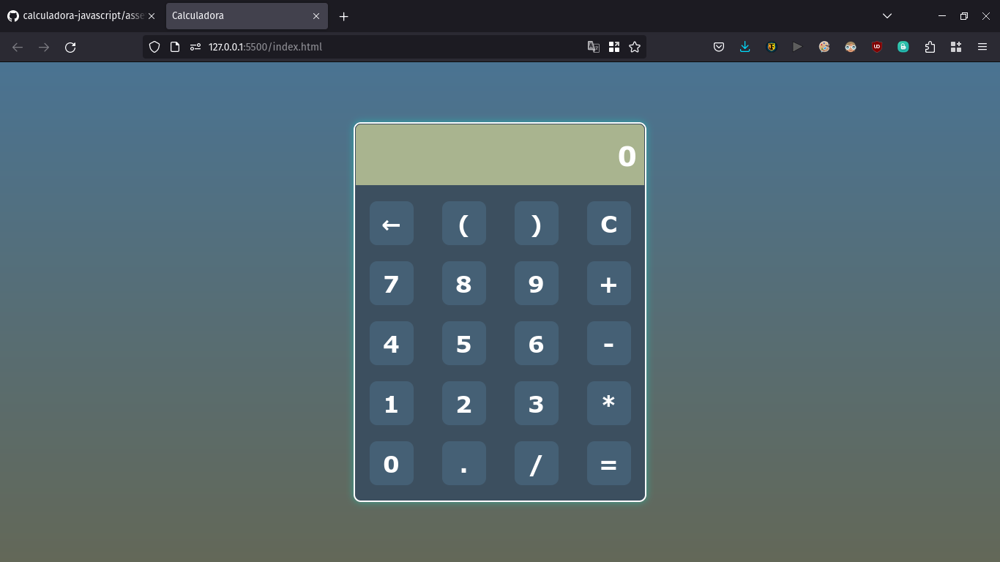

# App Calculadora.

Esse é um aplicativo de calculadora simple.

## Objetibo:

**Treinar meus conhecimentos em JavaScript.**

## Tecnologias utilizadas:
- JavaScript;
- HTML 5;
- SASS;
- "CSS 3".

## Print do resultado:

